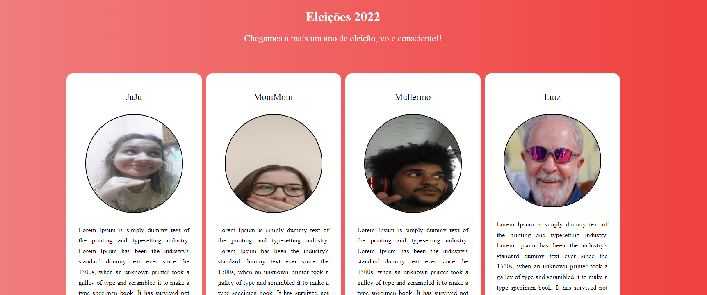

# Eleições 2022

<!---Esses são exemplos. Veja https://shields.io para outras pessoas ou para personalizar este conjunto de escudos. Você pode querer incluir dependências, status do projeto e informações de licença aqui--->

> O projeto Eleições 2022 tem como objetivo criar um sistema que ofereça ao usário a opção de votar no candidato desejado, apresentando eles na interface inicial. Ao entrar no projeto o usário é apresentado aos candidatos disponiveís e em seguida vota no candidato escolhido, ao fim é apresentado quantos votos cada candidato recebeu e quem foi eleito.

### Ajustes e melhorias

O projeto ainda está em desenvolvimento e as próximas atualizações serão voltadas nas seguintes tarefas:

- [ ] Organizar código para mostrar a interface inicial antes da votação
- [ ] Alterar fontes
- [ ] Melhorar interface inicial
- [ ] Retirar a votação dos prompt's

## 🛠️ Construído com

* [Visual Studio Code](https://code.visualstudio.com/) - Editor de código-fonte
* [HTML](https://developer.mozilla.org/pt-BR/docs/Web/HTML) - Usado para a marcação de texto
* [CSS](https://developer.mozilla.org/pt-BR/docs/Web/CSS) - Usado para estilizar o projeto
* [JavaScript](https://developer.mozilla.org/pt-BR/docs/Web/JavaScript) - Usado para dar a dinamicidade ao projeto

## 🤝 Colaboradores
<table>
  <tr>
    <td align="center">
      <a href="#">
         
        
          <b>Leandro Müller</b>
        
      </a>
    </td>
</table>

## 🎁 Expressões de gratidão

* Conte a outras pessoas sobre este projeto 📢
* Convide alguém da equipe para uma cerveja 🍺 
* Obrigado pela visita🤓.
