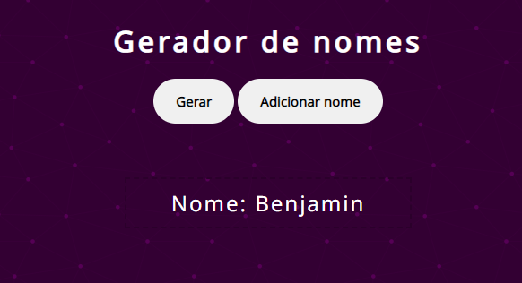

# Gerador de nomes

<!---Esses são exemplos. Veja https://shields.io para outras pessoas ou para personalizar este conjunto de escudos. Você pode querer incluir dependências, status do projeto e informações de licença aqui--->

<<<<<<< HEAD
![GitHub repo size]
![GitHub language count]
![GitHub forks]

=======

>>>>>>> d2abdaa9487fe298de5f8a2520753ca874f03379

> O projeto Gerador de nomes tem como objetivo oferecer nomes aleatórios para o usário, além de possibilitar que o usário adicione um novo nome para o array que armaneza os demais nomes.

### Ajustes e melhorias

O projeto ainda está em desenvolvimento e as próximas atualizações serão voltadas nas seguintes tarefas:

- [x] Adicionar mais nomes ao array
- [ ] Melhorar interface
- [ ] Adicionar input para o nome ser adicionado no próprio site

## 🛠️ Construído com

* [Visual Studio Code](https://code.visualstudio.com/) - Editor de código-fonte
* [HTML](https://developer.mozilla.org/pt-BR/docs/Web/HTML) - Usado para a marcação de texto
* [CSS](https://developer.mozilla.org/pt-BR/docs/Web/CSS) - Usado para estilizar o projeto
* [JavaScript](https://developer.mozilla.org/pt-BR/docs/Web/JavaScript) - Usado para dar a dinamicidade ao projeto

## 🤝 Colaboradores
<table>
  <tr>
    <td align="center">
      <a href="#">
         
        
          <b>Leandro Müller</b>
        
      </a>
    </td>
</table>

## 🎁 Expressões de gratidão

* Conte a outras pessoas sobre este projeto 📢
* Convide alguém da equipe para uma cerveja 🍺 
* Obrigado pela visita🤓.
